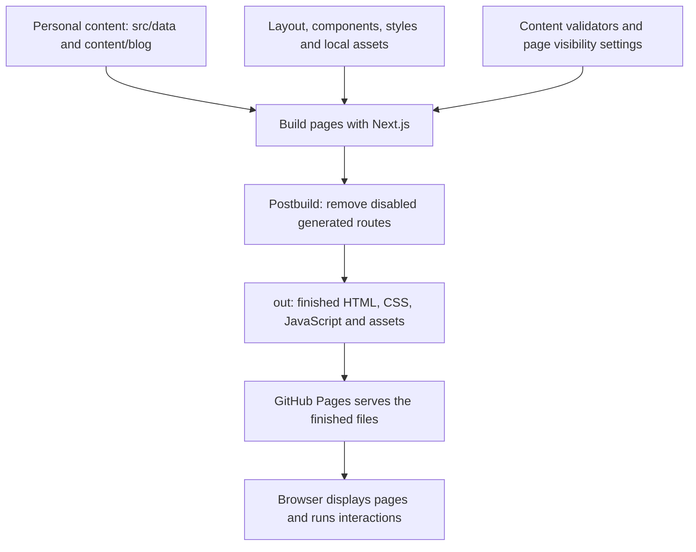
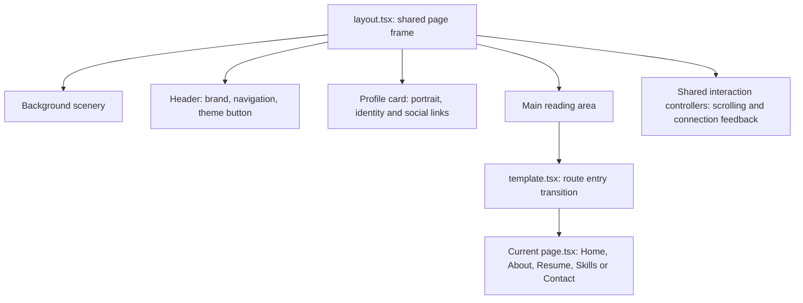
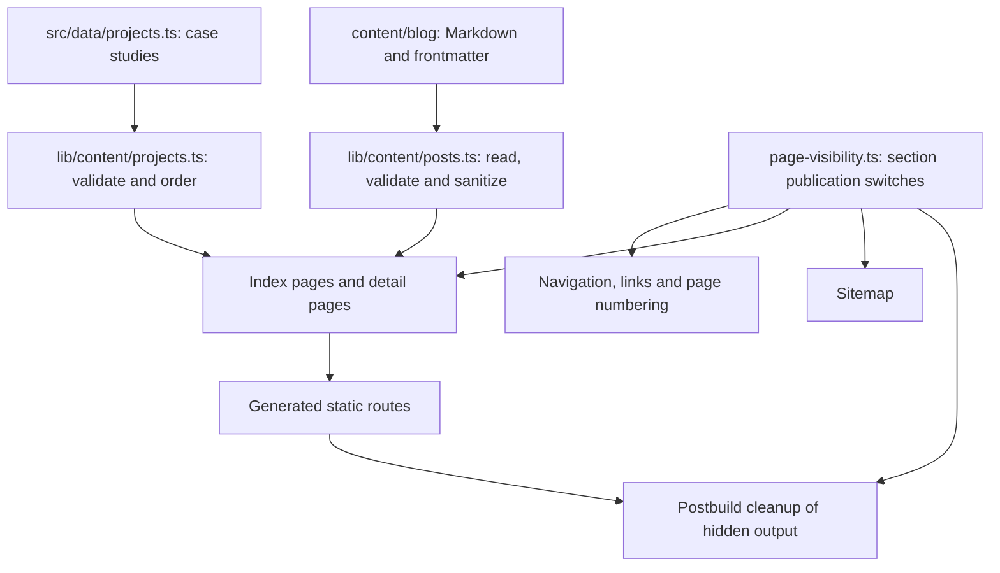
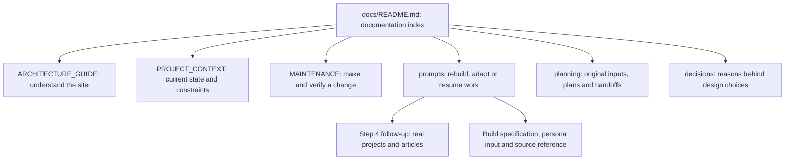

# Understand the website: architecture and documentation

Author: meetbyte  
Reviewed against the repository on 8 October 2026.

This guide explains how the current website is assembled, which files own each part, and how to use the documentation when making changes. Start with sections 1–3; use the later tables when you have a particular change in mind.

## 1. The overall flow

You edit the source. Next.js builds the pages into static files. GitHub Pages serves those files. The visitor's browser handles menus, themes and motion.



**Build time** means running the project locally or in the configured GitHub workflow. Article files are read and validated here. **Browser time** means a visitor opening the finished site. A component is a reusable piece of the page, such as the profile card. A route is a URL such as `/about/`.

The site uses Next.js App Router, React and TypeScript. Its [Next.js configuration](../next.config.ts) enables static export. There is no running Next.js server, database or CMS on the published site. Contact uses email links; it does not submit a message to a backend.

The [package scripts](../package.json) define development, checks, build and automatic postbuild cleanup. The [deployment workflow](../.github/workflows/deploy.yml) checks and builds the source, then publishes `out/` from `main`. Keep the source in the repository; `out/` is generated output and should not be edited to change the website.

## 2. What you see on the screen

The shared layout surrounds every page. During normal page navigation, the header and profile stay in place while the main reading area changes.



| Screen part | Main file | Responsibility |
| --- | --- | --- |
| Shared frame | [layout.tsx](../src/app/layout.tsx) | Loads fonts/styles, shared metadata, background, header, profile and main panel. Applies initial theme/season preferences before the first paint. |
| Changing page | [template.tsx](../src/app/template.tsx), [route-motion.tsx](../src/components/route-motion.tsx) | Wraps the route content and handles its entry transition. |
| Header navigation | [navigation.tsx](../src/components/navigation.tsx) | Active link, desktop marker and mobile disclosure menu. |
| Profile card | [profile-card.tsx](../src/components/profile-card.tsx), [role-rotator.tsx](../src/components/role-rotator.tsx) | Portrait, personal summary, links and rotating role text. |
| Scroll behavior | [shell-motion.tsx](../src/components/shell-motion.tsx) | Reading progress, portrait cropping, route scroll/focus handling and mobile header portrait. |
| Background | [site-scenery.tsx](../src/components/site-scenery.tsx), [celestial-body.tsx](../src/components/celestial-body.tsx) | Seasonal layers and sun/moon presentation. |
| Theme button | [theme-toggle.tsx](../src/components/theme-toggle.tsx) | Lets the visitor switch the current day/night theme. |

Wide, tall desktop windows use separate profile and reading-panel scroll areas. Smaller or shorter windows use normal document scrolling. Styles define the layout; `ShellMotion` coordinates the related behavior.

**Current choices:** Home, About, Resume, Skills and Contact are public. Projects and Blog are hidden. There is no footer. The season preview is disabled by default. The retained scenery pause/quality controls are not mounted in the current layout, so having their code in the repository does not mean visitors see those controls.

## 3. Folder map: what belongs where

```text
meetbyte.github.io/
├── src/
│   ├── app/                URLs, page structure, shared layout, SEO routes
│   ├── data/               Personal content and its TypeScript models
│   ├── constants/          Shared wording, URLs and behavior switches
│   ├── components/         Reusable visual pieces and browser interactions
│   ├── lib/                Focused logic, validation and shared helpers
│   ├── styles/             Colors, layout, scenery and finishing details
│   ├── assets/fonts/       Bundled fonts and their licenses
│   └── types/              Supporting TypeScript declarations
├── content/blog/           Markdown articles with frontmatter
├── public/                 Images, icons, CV and other directly served files
├── scripts/                Verification tests and export cleanup entry point
├── .github/workflows/      Build and deployment automation
├── docs/                   Guides, plans, reusable prompts and decisions
├── AGENTS.md               Instructions for coding agents
├── README.md               Setup and project entry point
├── package.json            Dependencies and available commands
└── next.config.ts          Static export configuration
```

Two generated folders are also important: `.next/` is Next.js build/development working output; `out/` is the finished static website. Neither is the source of your personal content.

The usual edit flow is **content → page → shared component → styles**. Change content in `data`; change the arrangement of one page in `app`; change a reusable piece in `components`; change its appearance in `styles`. Use `lib` when the behavior needs reusable logic.

### Page and content map

| Section | Content source | Page that displays it |
| --- | --- | --- |
| Identity across the site | [profile.ts](../src/data/profile.ts) | Shared layout and profile card; portrait file lives in `public/images/`. |
| Home | [home.ts](../src/data/home.ts) | [app/page.tsx](../src/app/page.tsx) |
| About | [about.ts](../src/data/about.ts) | [app/about/page.tsx](../src/app/about/page.tsx) |
| Resume | [resume.ts](../src/data/resume.ts), [cv.ts](../src/data/cv.ts) | [app/resume/page.tsx](../src/app/resume/page.tsx); CV download lives in `public/files/`. |
| Skills | [skills.ts](../src/data/skills.ts) | [app/skills/page.tsx](../src/app/skills/page.tsx) |
| Contact | [contact.ts](../src/data/contact.ts), profile social links | [app/contact/page.tsx](../src/app/contact/page.tsx) |
| Projects | [projects.ts](../src/data/projects.ts) | [Project index](../src/app/projects/page.tsx) and [individual case study](../src/app/projects/[slug]/page.tsx) |
| Blog | Files under `content/blog/` | [Blog index](../src/app/blog/page.tsx) and [individual article](../src/app/blog/[slug]/page.tsx) |

In a filename, `[slug]` means the URL name varies: one page template renders different entries, for example `/blog/my-article/`. Only entries included in the static build can have published routes.

[types.ts](../src/data/types.ts) defines the shape of the content. [content.ts](../src/constants/content.ts) contains shared interface wording. [routes.ts](../src/constants/routes.ts) names the URLs, while [navigation data](../src/data/navigation.ts) defines the menu entries. These have different jobs even though they all contain text.

### Appearance map

| File | What it controls |
| --- | --- |
| [colors.css](../src/styles/colors.css) | Shared light/dark color tokens. |
| [globals.css](../src/styles/globals.css) | Typography, responsive layout, cards, portrait and general motion. |
| [scenery.css](../src/styles/scenery.css) | Background layers and shared sun/moon scenery styling. |
| [seasons.css](../src/styles/seasons.css) | Seasonal artwork and artistic weather effects. |
| [polish.css](../src/styles/polish.css) | Final menu, focus, scrollbar and other finishing rules. |

These are imported by `layout.tsx` in the order shown. Check the later styles when an earlier rule seems overridden. Fonts are also declared in the layout; actual font files are in `src/assets/fonts/`. Public scenery images are under `public/images/scenery/`.

## 4. How Projects and Blog will work

The engines already exist. Step 4 later supplies genuine content and enables the chosen section after the owner requests publication.



**Projects:** add structured case studies to `src/data/projects.ts`. The [project loader](../src/lib/content/projects.ts) checks fields, unique slugs, links and media. Keep incomplete real projects in the [content worksheet](planning/PROJECT_BLOG_CONTENT_TEMPLATE.md) until ready: there is currently no per-project draft/published field. `placeholder` identifies illustrative sample content; it is not a privacy switch.

**Blog:** add an article under `content/blog/`. Its frontmatter is the information at the top of the Markdown file: title, slug, date, excerpt, tags and publication state. The [article loader](../src/lib/content/posts.ts) converts approved Markdown to sanitized HTML at build time. `published: false` excludes a draft. Use `##` for the first article section heading because the page supplies the title heading.

**Publication:** [page-visibility.ts](../src/constants/page-visibility.ts) currently sets both sections to `false`. These flags drive menus, route guards, generated detail routes, sitemap and cleanup. Hiding a menu link alone is not sufficient. The [postbuild entry point](../scripts/finalize-export.ts) uses [safe cleanup logic](../src/lib/finalize-export.ts) to remove disabled generated route directories and reserved `_unpublished` detail output. It preserves source files. On a static host, missing routes then use the generated 404 page.

Use [04_RESUME_PROJECTS_AND_BLOG.md](prompts/04_RESUME_PROJECTS_AND_BLOG.md) when you are ready. It explains intake, replacing samples, the publication boundary and verification without rebuilding the existing website.

## 5. How browser behavior is organized

| Feature | Logic and controller | Plain-language flow |
| --- | --- | --- |
| Day/night theme | [theme.ts](../src/lib/theme.ts), [theme-toggle.tsx](../src/components/theme-toggle.tsx) | Choose the initial theme from the visitor's local hour; a manual change is remembered for the tab session. Day starts at 07:00 and night at 19:00. |
| Season | [season.ts](../src/lib/season.ts), [config.ts](../src/constants/config.ts) | Choose artwork from the local month. The optional header preview appears only when `showSeasonPicker` is enabled. This is an artistic calendar, not live weather or geolocation. |
| Time boundaries | [atmosphere-clock.ts](../src/lib/atmosphere-clock.ts) | Schedule the next change and catch up when the browser returns after sleep. |
| Sun/moon transition | [theme-journey.ts](../src/lib/theme-journey.ts), scenery components | Coordinate the orbit and readable intermediate colors; a new choice can reverse an ongoing transition. |
| Reduced motion | [scenery-motion.ts](../src/lib/scenery-motion.ts), motion components | Honor the visitor's system preference and resolve stored ambient preferences. |
| Slow/offline feedback | [connection.ts](../src/lib/connection.ts), [connection-provider.tsx](../src/components/connection-provider.tsx), [site-link.tsx](../src/components/site-link.tsx) | Use available connection hints, reduce scenery cost when appropriate, and provide navigation status/recovery links. |
| Image fallback | [site-image.tsx](../src/components/site-image.tsx) | Reserve image space and show a fallback if loading fails. |

The initial preference scripts in `layout.tsx` run before the browser first draws the page. Interactive React components then attach their behavior, a process called hydration. Files marked `"use client"` handle browser state and events; ordinary page/layout rendering happens during the static build for the published site.

## 6. Which document should I read?



| Your purpose | Read/use this |
| --- | --- |
| Understand the files and flows | This guide. |
| Continue in a new chat after deleting the old ChatGPT project | [PROJECT_CONTEXT.md](PROJECT_CONTEXT.md), then [MAINTENANCE.md](MAINTENANCE.md). |
| Find all documents | [docs/README.md](README.md). |
| Run the project or understand deployment | [Repository README](../README.md). |
| Make a routine edit | [MAINTENANCE.md](MAINTENANCE.md) and the change table below. |
| Rebuild this website or adapt it for another person | [Prompts README](prompts/README.md), [Prompt 00](prompts/00_START_HERE.md), [BUILD_SPEC.md](prompts/BUILD_SPEC.md) and [PERSONA_TEMPLATE.md](prompts/PERSONA_TEMPLATE.md). |
| Add real projects and posts later | [Step 4 follow-up](prompts/04_RESUME_PROJECTS_AND_BLOG.md) and [content worksheet](planning/PROJECT_BLOG_CONTENT_TEMPLATE.md). |
| Understand the original personal inputs | [Completed questionnaire](planning/PERSONAL_WEBSITE_CONTENT_COMPLETED.md). Final displayed wording is in `src/data/`. |
| Understand earlier stages and their status | Documents under `planning/`, including [Stage 3 handoff](planning/STAGE_3_HANDOFF.md). |
| Understand why a visual choice was made | Implementation notes under `decisions/`; start with [layout cleanup](decisions/Layout-Cleanup-Notes.md). |
| Add useful code descriptions | [COMMENTING_GUIDE.md](COMMENTING_GUIDE.md), using author `meetbyte`. |
| Check provenance and missing historical records | [Prompt audit](prompts/AUDIT_AND_PROVENANCE.md) and [continuity review](planning/REPOSITORY_CONTINUITY_REVIEW_2026-10-08.md). |

`planning/` preserves the work's inputs and history. `prompts/` contains the active reusable instructions. `decisions/` explains choices. `archive/` and `prompts/archive/` preserve older records. `prompts/reference/` holds a dated source snapshot and manifest; carry the whole documentation pack alongside it for the newer guides.

Historical handoffs describe earlier versions and may mention controls or enabled sections that have since changed. For current behavior, check the source and `PROJECT_CONTEXT.md`; use `BUILD_SPEC.md` for the reusable rebuild requirements. Preserve historical text rather than silently rewriting it. When behavior changes, update the current guides and relevant specification.

For another persona, copy the persona template and supply approved facts in a separate destination. Update metadata, brand wording, portrait, CV, social preview and icons as well as content; changing `profile.ts` alone does not replace every personal reference. For the same implementation, retain the source and assets: prompts alone cannot guarantee identical generated code or pixels.

## 7. “I want to change…”

| Change | Start here | Follow-through |
| --- | --- | --- |
| Add a skill or change a biography sentence | Matching `src/data/` file | Review the rendered page; change the page/component only if the structure also changes. |
| Replace the portrait | `src/data/profile.ts` and `public/images/` | Supply correct alt text and dimensions; inspect desktop and mobile cropping. |
| Replace the downloadable CV | `public/files/` and `src/data/cv.ts` | Check the download and ensure the configured path matches the actual file. |
| Change email or social links | `src/data/contact.ts` and `src/data/profile.ts` | Test email/subject and destination links. |
| Change colors | `src/styles/colors.css` | Check both themes, contrast and intermediate theme transitions. |
| Change card layout or spacing | `src/styles/globals.css`, then `polish.css` | Review desktop and mobile sizes, keyboard focus and scrolling. |
| Change a menu label | `src/data/navigation.ts` and shared wording where relevant | Use `constants/routes.ts` for URL changes; check active link behavior. |
| Add a real project or article | Step 4 follow-up and content worksheet | Validate content first; enable the chosen section only with the owner's publication instruction, then rebuild and inspect the output. |
| Change search/social previews | [metadata.ts](../src/lib/metadata.ts), metadata exports in `src/app/`, shared content and public preview assets | Check canonical origin, page titles, descriptions and social image together. [sitemap.ts](../src/app/sitemap.ts) and [robots.ts](../src/app/robots.ts) generate search-engine files. |
| Add a new behavior | Relevant component and focused `src/lib/` module | Keep configuration separate; preserve reduced motion, cleanup and native keyboard behavior. |

### Change and verification flow

1. Read the current context and find the owning file above.
2. Make the smallest appropriate source change. Keep content out of presentation code when the existing content model supports it.
3. Run the relevant checks. For functional changes, the normal full sequence is `npm run lint`, `npm run typecheck`, `npm test`, then `npm run build`. See the repository README for clean-install preparation and the Windows `--webpack` build fallback.
4. Review the finished static output and the affected interactions. A content/visibility change needs a rebuild before the published output can reflect it.
5. Update current context/specification if behavior changed; add future handoffs to `planning/` and decision explanations to `decisions/`.
6. Keep publication separate from local editing. Commit, push and deployment require the owner's instruction.

The tests under `scripts/` cover content rules, atmosphere timing, theme transitions, motion preferences and reliability boundaries. They support the build checks; visual layout, reading experience and keyboard use also need direct review. Pure documentation edits can be checked by reviewing their accuracy and local links without rebuilding the website.

## 8. A short learning route

Follow one piece of content end to end: open [skills.ts](../src/data/skills.ts), then [Skills page](../src/app/skills/page.tsx), then [page-heading.tsx](../src/components/page-heading.tsx), and finally [globals.css](../src/styles/globals.css). This shows content, page arrangement, a shared component and appearance in that order.

Next, read [layout.tsx](../src/app/layout.tsx) to see how that page fits inside the shared website. Finish with [PROJECT_CONTEXT.md](PROJECT_CONTEXT.md) and [the prompts index](prompts/README.md) to understand how to continue the work in a future chat.
